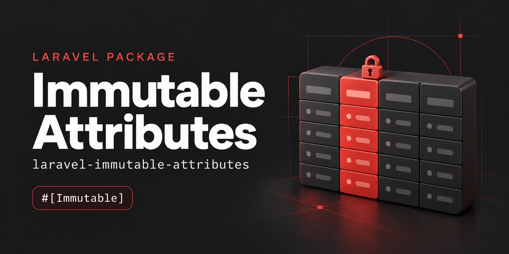

# Laravel Immutable Attributes

> **Columns that are set once and never change: declare them on the Eloquent model, and every save that would alter them throws.**


```php
#[Immutable('number', 'customer_id', 'issued_at')]
class Invoice extends Model
{
    use GuardsImmutableAttributes;
}

$invoice->number = 'INV-999';
$invoice->save(); // ImmutableAttributeException, nothing is written
```

## Why this package?

Some values must stay what they were when the row was written: an invoice
number that is already on a sent PDF, the owner of an order, the text a person
consented to. When code changes one of them by mistake, nothing fails. The row
looks normal, and the damage shows up much later.

- **`$guarded` does not help.** It only stops mass assignment; `$invoice->number = ...` still goes through
- **One declaration instead of a listener per model.** The usual fix, an `updating` listener that checks `isDirty()`, ends up copied into every model that needs it
- **Covers the paths a listener misses.** Saves without events (`saveQuietly()`, `withoutEvents()`) and changes made by a later `updating` listener or observer are caught too
- **Inserts are untouched.** The attributes are set freely until the row exists
- **Same value is not a change.** The check uses Eloquent's own dirty tracking, casts included

## Requirements

- PHP 8.3+
- Laravel 12 or 13

## Installation

```bash
composer require taldres/laravel-immutable-attributes
```

There is nothing to publish or configure.

## Usage

Add the trait and list the immutable attributes with `#[Immutable]`:

```php
use Illuminate\Database\Eloquent\Model;
use Taldres\ImmutableAttributes\Attributes\Immutable;
use Taldres\ImmutableAttributes\Concerns\GuardsImmutableAttributes;

#[Immutable('number', 'customer_id', 'issued_at')]
class Invoice extends Model
{
    use GuardsImmutableAttributes;
}
```

`#[Immutable(['number', 'customer_id'])]` works as well. Without arguments the
whole model is immutable once it exists, which suits append-only tables such as
logs or ledgers:

```php
#[Immutable]
class LedgerEntry extends Model
{
    use GuardsImmutableAttributes;
}
```

Columns stack: `#[Immutable]` on a parent model, on the model itself, and on any
trait they use are merged, so a child model can add attributes but never release
one.

`Immutable` can be extended for a named preset. The subclass needs its own
`#[Attribute]` marker:

```php
#[Attribute(Attribute::TARGET_CLASS)]
class AppendOnly extends Immutable
{
    public function __construct()
    {
        parent::__construct('*');
    }
}
```

To decide at runtime, override `getImmutableAttributes()`:

```php
public function getImmutableAttributes(): array
{
    return $this->isFinalized() ? ['*'] : ['number'];
}
```

### The exception

A violation throws `Taldres\ImmutableAttributes\Exceptions\ImmutableAttributeException`,
a `RuntimeException`, before the update query runs:

```php
try {
    $invoice->update(['number' => 'INV-999', 'paid' => true]);
} catch (ImmutableAttributeException $e) {
    $e->model;      // App\Models\Invoice
    $e->key;        // 42
    $e->attributes; // ['number']
}
```

The model keeps its unsaved changes; call `$invoice->refresh()` to discard them.

### What is guarded

| Guarded | Not guarded |
| --- | --- |
| `save()`, `update()`, `push()` | Query builder writes: `Invoice::whereKey($id)->update([...])`, `upsert()`, raw queries |
| `fill()` and `forceFill()` followed by a save | `incrementQuietly()` and `decrementQuietly()`, which fire no events and write their own query |
| `saveQuietly()`, `updateQuietly()`, `Model::withoutEvents()` | Deleting and soft deleting |
| Changes made by `updating` listeners and observers | |
| `increment()` and `decrement()`, including their extra columns | |
| `touch('column')` on an immutable column | |

The query builder stays open on purpose: it is the escape hatch for deliberate
corrections, data migrations and erasure.

A model that overrides `getDirtyForUpdate()` itself replaces the package's
check for saves without events.

## AI agents

The package ships a [Laravel Boost](https://github.com/laravel/boost) skill,
`laravel-immutable-attributes-development`. Run `php artisan boost:install` and
select `taldres/laravel-immutable-attributes` among the third-party packages. A
non-interactive install only picks up packages listed under `packages` in
`boost.json`.

## Development

Built on the [Laravel package skeleton](https://github.com/laravel/package-skeleton):

```bash
composer test       # PHPStan level 10, Pint, type coverage, Pest
composer lint       # Pint
```

See [CONTRIBUTING](.github/CONTRIBUTING.md) and the [changelog](CHANGELOG.md).

## Security Vulnerabilities

Please review [our security policy](.github/SECURITY.md) on how to report security vulnerabilities.

## License

MIT. See [LICENSE.md](LICENSE.md).
